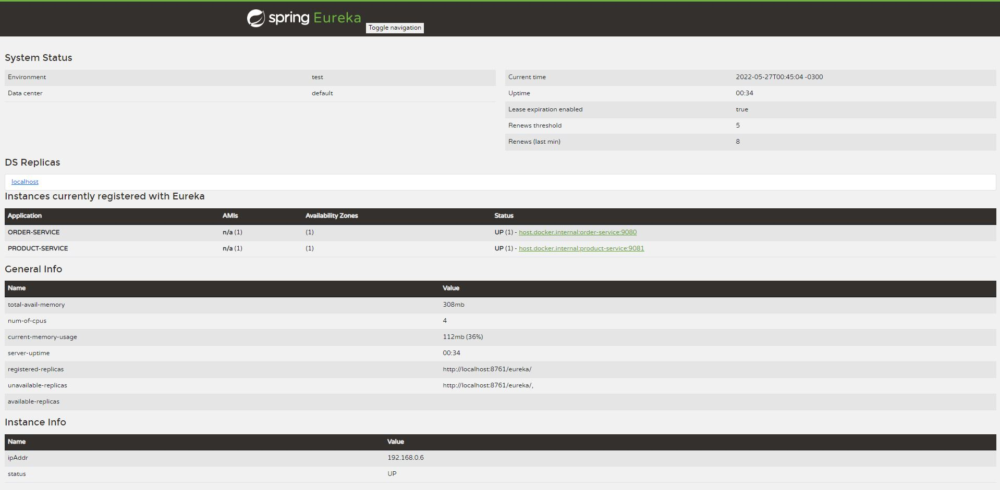
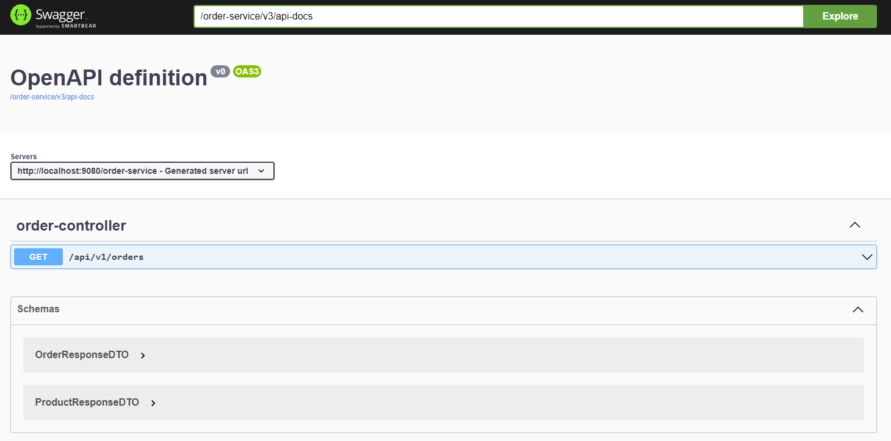

# Spring Cloud Eureka Sample

The project is an example of using the Netflix Eureka service registration and discovery.

1. [ ] **Observation:**

Client applications when registering with Eureka are not set their context path, only host + port. One way found by the community is to add this value to the metadata-map and thus be consulted by the eurekaClient.

In this project, eurekaClient with rest template is used making use of the metadata-map, which is not possible by Feign, where it was necessary to manually inform the context-path of the client to be requested.

## Requirements

Java 11+

IntelliJ IDEA / Netbeans / Eclipse

## Usage

```python

1) Start all projects

2) Check if projects have registered with Eureka: http://localhost:8761/

3) Rest template call:
   curl --location --request GET 'http://localhost:9080/order-service/api/v1/orders'
   
   Feign call:
   curl --location --request GET 'http://localhost:9080/order-service/api/v1/orders?httpRestClientType=FEIGN'   
```


## Documentation

[Swagger](http://localhost:9080/order-service/swagger-ui/index.html)



## Contributing
Pull requests are welcome. For major changes, please open an issue first to discuss what you would like to change.

Please make sure to update tests as appropriate.

## License
[MIT](https://choosealicense.com/licenses/mit/)